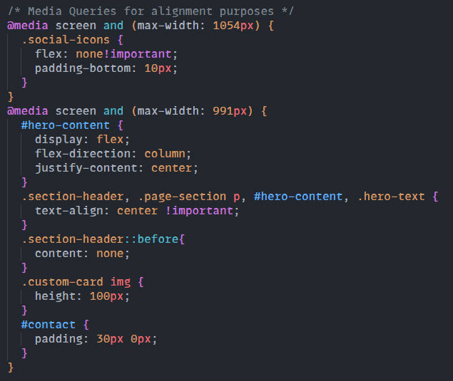

# My Portfolio

## Description
For this weeks bootcamp challenge, we were asked to re-build our portfolio pages with Bootstrap to reduce the number of media queries used and to make use of the 'cards' for our portfolio sections.  

To guide us, we were given a list of Acceptance Criteria to ensure the critical requirements were met. They are as follows:

> The website should include the following bootstrap components:
> - A Navigation bar
>    - A navigation menu at the top. Feel free to use bootstrap's navbar or create your own.
>    - Include links that are applicable to your portfolio.
>    - Links should navigate to the appropriate sections 
> - A hero section
>    - A jumbotron featuring your picture, your name, and any other information you'd like to include.
> - A work section
>    - A section displaying your work in grid. 
>    - If you need to use placeholder image use: https://placehold.co/ 
>    - Use bootstrap cards for each project.
>    - The description should give a brief overview of the work.
>    - Each project will eventually link to your class project work!
> - A skills section
>    - List out the skills you expect to learn from the bootcamp.
> - An about / contact section.
>    - An "About Me" section in the same row.
> - A footer section.
> - All hyperlinks should have a hover effect.
> - All buttons should display a box shadow upon hover.
## Learning Points
I really enjoyed using Bootstrap, it's a great time saver and allows you to quickly build page templates before adding your own personalisations to make it your own. 

This time round I was able to use a nav-bar that opens at that the side creating a unique look and feel to my site. See the below image:

I also took the time to create a skills area using Bootstrap cards to create a responsive grid that will size up and down according to the screensize. 

I also took the time to learn about keyframes and how they can be used to create cool effects, such as the colour changer I have used in my own project. 

## Useful Information
The page is deployed on GitHub - [Click here](https://rbrd87.github.io/Bootstrap-Portfolio/)

The repository of the project is also hosted on GitHub - [Click here](https://github.com/rbrd87/Bootstrap-Portfolio)

## Screenshots

Here is what the finished re-vamped portfolio section looks like

### DESKTOP

Here you can also see the responsiveness of site due to the media queries used
### TABLET

### MOBILE

Below is a snippet of HTML code, where you can see how I created my new side nav bar. 

Here is a screenshot of how little I used Media Queries due to the responsive design I created using Bootstrap!

 
 

<h3>The End</h3>
🤍

